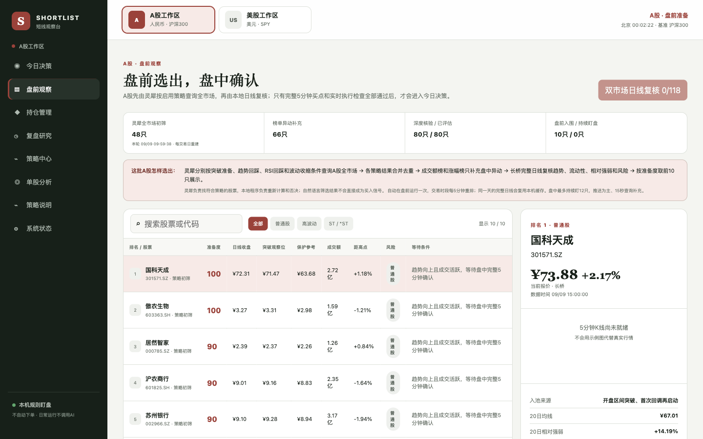
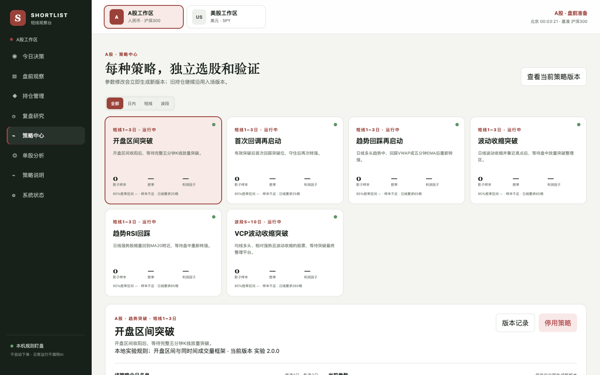
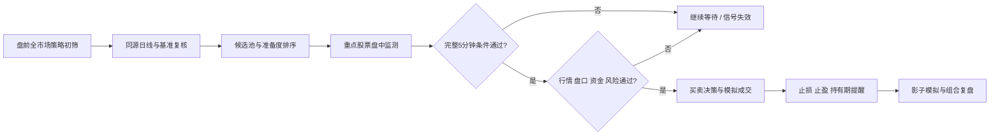

<div align="center">


# SHORTLIST · 短线＋波段观察台

**盘前按策略筛选，盘中等条件确认，买入前先算止损、止盈和仓位。**

[](https://github.com/zc6503204-collab/stock-strategy-dashboard/actions/workflows/ci.yml)
[](https://github.com/zc6503204-collab/stock-strategy-dashboard/releases)
[](LICENSE)
[](requirements.txt)
[](#安全边界)

[功能](#它解决什么问题) · [界面](#界面预览) · [快速开始](#快速开始) · [操作指南](docs/USER_GUIDE.md) · [策略](docs/STRATEGIES.md) · [安全](SECURITY.md) · [参与贡献](CONTRIBUTING.md)

</div>

SHORTLIST 是一个在 Mac 本机运行的 A股与美股策略研究、模拟交易和持仓提醒工作台。它把**全市场策略初筛、日线复核、完整5分钟K线确认、统一资金风控、持仓提醒和分策略复盘**放在同一条可追溯流程中。

> [!IMPORTANT]
> 默认独立研究、只读取行情；只有手动开启账户模式后才读取持仓，不提交真实订单。策略均为实验规则；“准备度”表示值得观察的程度，不代表胜率或买入建议。

## 它解决什么问题

| 盘前 | 盘中 | 买入前 | 买入后 |
|---|---|---|---|
| 按启用策略查询市场，生成当天候选 | 只盯重点股票，等待完整K线和盘口条件 | 同时给出买入区间、不追价线、数量、止损和止盈 | 跟踪真实或模拟持仓，提醒止损、减仓和到期退出 |

- **A股与美股分开工作。** 候选、基准、货币、交易时间、持仓和复盘不会交叉。
- **代码计算，规则解释。** 均线、ATR、VWAP、相对强弱、量比、成本和仓位由程序计算。
- **允许空仓。** 行情、盘口、市场状态或风险预算有一项不合格，就显示“等”或“不买”。
- **日常盯盘不调用 AI。** 只有你在“GPT 选股”主动生成任务、把答案粘回时才进入双向研究流程；本机不会自动操控或读取 ChatGPT。
- **保留证据。** 每条信号记录数据时间、行情来源、策略版本、触发原因和退出规则。

## 界面预览

### 盘前观察：说明候选从哪里来



A股通过长桥分页更新证券库，再逐股检查沪深主板和创业板的同源日线、流动性、相对强弱与策略条件；科创板和北交所不在首版范围。先完成范围研究，再收敛到最多80只候选、12只实时监测。榜单不是入选前提。页面展示实际检查数、缺口和更新时间；上图为旧版示例界面。

### 策略中心：每种策略独立选股和验证



每个市场独立保存参数和版本。参数变更不会改写旧持仓；新版本重新积累前向样本。结束交易不足30笔时继续显示“样本不足”。

## 工作流程



A股在交易日9:10自动准备、9:20发布计划，盘中每30分钟轻量复筛完整支持范围，每5分钟复核研究池；15:05开始更新完整日线，15:10保存日报。首次日线预热可能跨时段，使用逐股缓存续跑。新旧候选每天重新判断资格，普通监测名额采用优先级和连续两轮领先至少5分的替换规则；模拟持仓、有效计划和手动固定股票优先。该门槛用于减少切换，不代表盈利参数。服务须开机联网、授权有效；延迟、断线和缺数据不会显示为扫描完成。美股维持原有发现路径。

## 快速开始

需要 macOS、Python 3.10 或更高版本，以及你自己的行情权限。没有配置行情凭证时页面仍可启动，但不会产生可靠的实时买点。

```sh
git clone https://github.com/zc6503204-collab/stock-strategy-dashboard.git
cd stock-strategy-dashboard
python3 -m venv .venv
.venv/bin/pip install -r requirements.txt
./start.command
```

浏览器打开 [http://127.0.0.1:8765/](http://127.0.0.1:8765/)。macOS 用户以后可以直接双击 `start.command`；安装登录后台服务和通知助手请运行：

```sh
.venv/bin/python scripts/install_background.py
```

第一次使用建议依次完成：

1. 在“系统状态”连接自己的行情源，并确认权限和数据时间。
2. 在“盘前观察”运行当天的全市场策略筛选。
3. 将重点候选加入盘中监测，等待完整5分钟确认。
4. 在“今日决策”查看买、等、不买和持仓处理结论。
5. 真实成交后到“持仓管理”手工登记或只读同步，才能按实际成本盯盘。
6. 需要外部深研时，打开“GPT 选股”：生成要求 `@longbridge` 先扫描全市场的任务，在 ChatGPT 完成后把整段答案粘回；GPT最多精选3只，本机再逐只核验实时价格、盘口、信号、不追价和失效条件。

更完整的逐页说明、更新时间和故障排查见 [《使用指南》](docs/USER_GUIDE.md)。

## 数据源

| 数据源 | 当前职责 | 接入方式 |
|---|---|---|
| 长桥 | 策略主行情、日线、5分钟K线、盘口与可选持仓同步 | 在“系统状态”完成本机 OAuth 授权 |
| 国泰海通灵犀 | A股全市场策略初筛和补充查询 | 运行 `python3 scripts/install_lingxi.py`，再把自己的配置留在 `.local/` |
| 盈透 IBKR | 美股行情核验、备用接口和可选持仓同步 | 启动本机 TWS / IB Gateway，并保持只读 API |
| Longbridge ChatGPT App | 用户确认后在 ChatGPT 中刷新行情、财务、新闻和账户查询 | 从“GPT 研究”打开官方入口；连接状态以 ChatGPT 内确认为准，详见 [Longbridge MCP 文档](https://open.longbridge.com/docs/mcp) |
| 同花顺普通客户端 | 人工核对 | 不作为程序数据源 |

行情权限以数据供应商对 API 的实际授权为准；交易软件中能看到行情，不等于 API 一定能读取相同市场和深度。单个策略的价格、K线和成交量保持同一来源，不把不同供应商的成交量混合计算。

当前GPT流程是手工复制/粘贴，不调用模型接口。若未来接受独立API计费，可在不改券商层的前提下接入 [OpenAI Responses API](https://developers.openai.com/api/reference/cli/resources/responses/methods/create) 与 [MCP/连接器](https://developers.openai.com/api/docs/guides/tools-connectors-mcp)；本期不读取OpenAI Key。

## 策略

当前内置7种实验策略：

| 策略 | 市场 | 周期 | 盘中确认重点 |
|---|---|---|---|
| 开盘区间突破 | A股 / 美股 | 1–3日 | 完整5分钟突破、VWAP、同时间量能 |
| 首次回调再启动 | A股 / 美股 | 1–3日 | 突破后首次回踩守住并再次转强 |
| 趋势回踩再启动 | A股 / 美股 | 1–3日 | 回踩VWAP或EMA20后放量恢复 |
| 波动收缩突破 | A股 / 美股 | 1–3日 | 靠近高点且波动收缩后的平台突破 |
| 趋势RSI回踩 | A股 / 美股 | 1–3日 | 强势后缩量回撤，再次站回盘中趋势 |
| VCP波动收缩突破 | A股 / 美股 | 5–10日 | 多头排列、相对强势和最终平台突破 |
| 20分钟开盘区间突破 | 美股 | 日内 | 10:00–11:30确认，15:50前退出 |

策略的完整条件、止损止盈、模拟口径和样本判断见 [《策略与验证说明》](docs/STRATEGIES.md)。开源项目的调研与取舍见 [《GitHub 项目调研》](docs/GITHUB_RESEARCH.md)。

## 风险与退出

默认模拟资金为人民币、美元各100,000；每笔计划风险0.25%，每市场最多3只持仓，其中最多1只波段仓位。普通短线策略达到2倍初始风险时减半，余仓按完整K线上移保护，最迟第三个交易日退出。A股执行100股手数、T+1、停牌和涨跌停约束。

止损价是风险处理条件，不是保证成交价。跳空、停牌、涨跌停或流动性不足都可能使实际亏损超过计划风险。

## 安全边界

- 服务只监听 `127.0.0.1`，静态服务只开放 `web/`。
- 券商连接保持只读；仓库没有提交、撤销或修改真实订单的接口。
- GPT 工作台不调用 OpenAI API；当日提示词、完整回答和可选对话链接只保存在本机。收盘后完整问答与账户上下文会清除，只保留脱敏结构化候选、本地核验和复盘指标。
- 账户数据每次默认不包含；勾选后只输出脱敏资产摘要和最多40只持仓，不输出账户号、订单编号、OAuth 或其他凭证。
- 导入的 ChatGPT 答案按不可信外部文本处理，只解析 `SHORTLIST_RESULT_V1` 标记内的 JSON；HTML、链接、脚本和操作指令不会执行。
- API Key、OAuth 令牌、数据库、行情缓存和日志只保存在被 Git 忽略的 `.local/`。
- 提交或打包前运行 `python3 scripts/check_no_secrets.py --history`，不要上传整个工作目录。

凭证轮换、私密漏洞报告和公开发布检查见 [SECURITY.md](SECURITY.md)。供应商 SDK、运行时下载的灵犀组件和行情数据仍受各自条款约束，不随本仓库重新授权或分发。

## 开发与验证

```sh
.venv/bin/python -m pytest -q
node --check web/app.js
python3 scripts/check_no_secrets.py --history
```

欢迎提交策略实现、数据完整性、回放验证、界面和文档改进。请先阅读 [CONTRIBUTING.md](CONTRIBUTING.md)。

本项目采用 [MIT License](LICENSE)。
